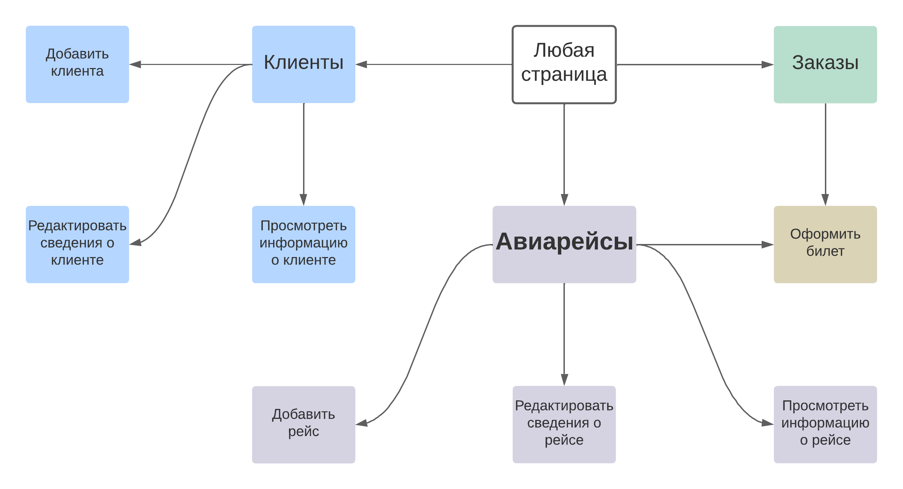
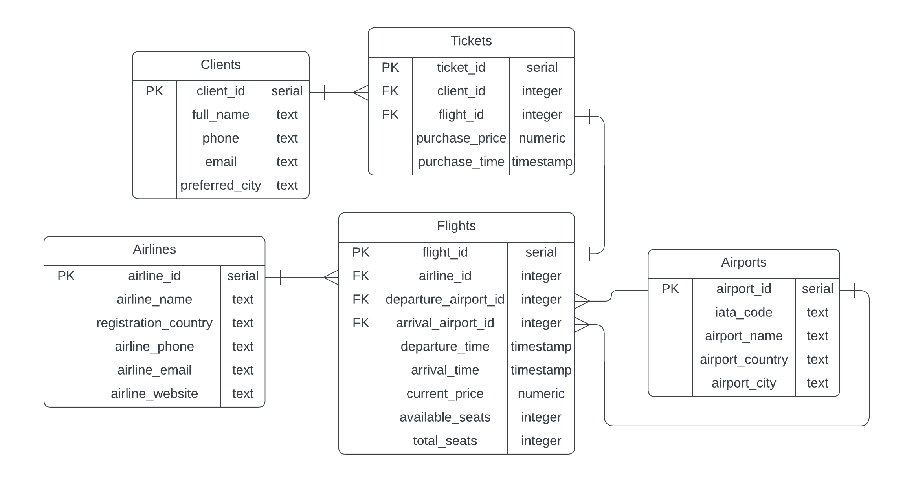

# WebPracCS

## Система информации об авиарейсах и билетах

Задание выполнил Рябыкин Владислав Александрович, студент 327 группы факультета ВМК МГУ.

Более подробно ознакомиться со всеми схемами и описанием сайта можно в /docs.

-------------------------------
Навигация между страницами:

-------------------------------
Схема базы данных:

